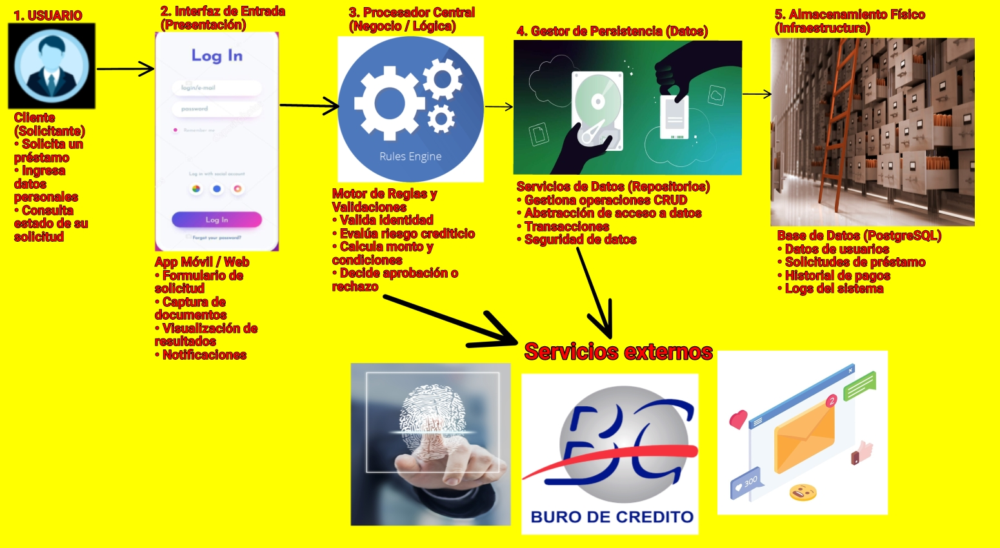

# Tarea 2: Estilos Arquitectónicos

**Proyecto:** FinTech & Micro-Préstamos.

## 1. Decisión
* **Estilo Macro:** Cliente-Servidor.
* **Estilo Interno:** Arquitectura Hexagonal (Puertos y Adaptadores).

## 2. Boceto
*(El diagrama de flujo crítico de la plataforma se ilustra a continuación).*

## 3. Justificación del Estilo Arquitectónico

Para la plataforma FinTech y Micro-Préstamos, hemos seleccionado el estilo macro Cliente-Servidor y el estilo interno de Arquitectura Hexagonal, también conocida como de Puertos y Adaptadores. Esta decisión se fundamenta en el cumplimiento estricto de nuestros atributos de calidad críticos:

1. **Seguridad, específicamente orientada a la responsabilidad y la inmutabilidad:** En el sector financiero, el motor de reglas de negocio, que contempla la evaluación de riesgo, la aprobación de créditos y el registro de auditoría, es el activo más crítico. La Arquitectura Hexagonal nos permite aislar este Procesador Central, que corresponde a la caja tres de nuestro boceto, en el núcleo del sistema. Al hacerlo, garantizamos que ni la interfaz de usuario, ya sea la aplicación móvil o la plataforma web, ni las bases de datos externas puedan alterar las reglas de validación directamente. Esto blinda la lógica de negocio contra vulnerabilidades externas y asegura que el registro de auditoría o bitácora de eventos sea inmutable.

2. **Interoperabilidad y Modificabilidad:** Nuestro sistema depende de integraciones con terceros, tales como el Buró de Crédito y los servicios de notificaciones. La Arquitectura Hexagonal utiliza un modelo de adaptadores para estas conexiones externas. Si en el futuro el Buró de Crédito cambia su API o si decidimos migrar nuestra base de datos PostgreSQL a otro proveedor en la nube, solo necesitamos reescribir ese adaptador específico. El núcleo de nuestra aplicación, donde residen las reglas del préstamo, se mantiene intacto, reduciendo el costo y el riesgo de futuras modificaciones.