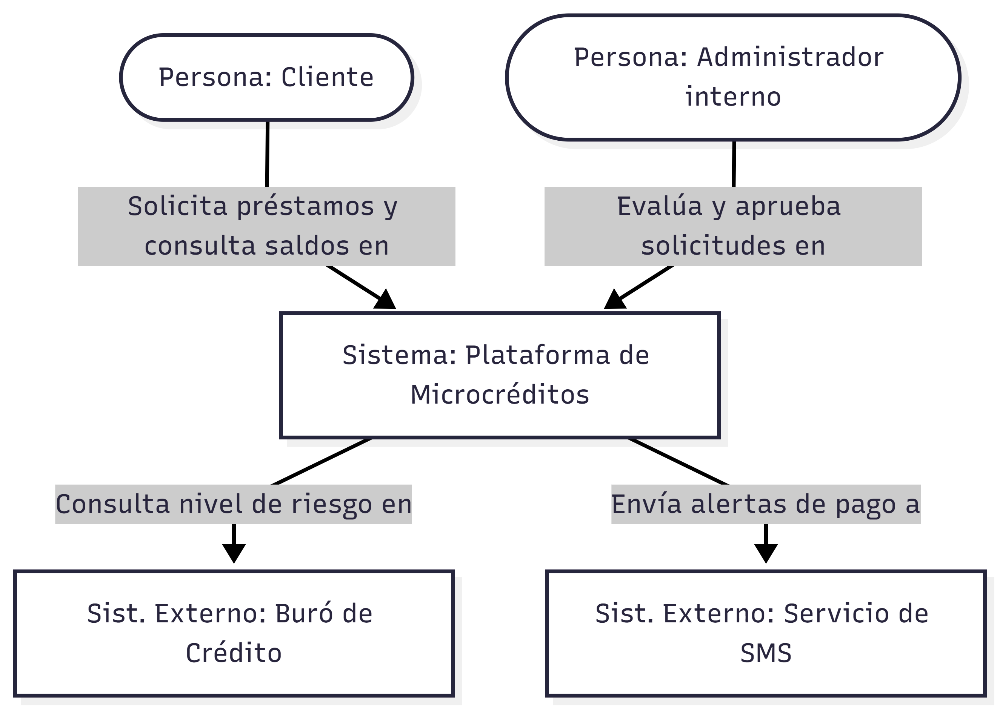
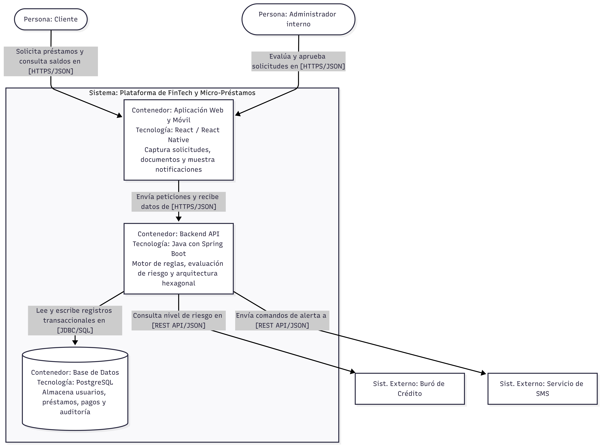

# Tarea 3: Diseño Arquitectónico Modelo C4

## 1. Nivel 1: Diagrama de Contexto

## 2. Nivel 2: Diagrama de Contenedores

## 3. Análisis de la "Caja Rota" mediante Simulación de Fallos

**Escenario:** El contenedor de la Base de Datos PostgreSQL pierde conexión durante 10 minutos.

**¿Qué ocurre con el resto de los contenedores?**
El Frontend seguirá funcionando y renderizando la interfaz gráfica, pero no podrá cargar listas ni procesar nuevas solicitudes. El Backend API se mantendrá activo en el servidor, pero al intentar procesar lógica de negocio, sus adaptadores de persistencia fallarán al no encontrar la base de datos, generando excepciones internas.

**¿Cómo se entera el usuario?**
El usuario visualizará un mensaje amigable en la interfaz. Por motivos de seguridad, nunca se mostrará el stacktrace del error directamente en pantalla para evitar exponer la vulnerabilidad de la base de datos caída.

**¿Qué estrategia de manejo de errores se implementará?**
El Backend capturará la excepción de conexión y devolverá un código de error HTTP 503 Service Unavailable al Frontend. Internamente, se implementará un patrón Circuit Breaker para detener las peticiones repetitivas a la base de datos mientras esté caída, y el evento de falla quedará registrado en un log de auditoría seguro.

## 4. El Diccionario de Contenedores

| Contenedor | Tecnología | Responsabilidad Principal | ¿Cómo se despliega en entorno Local? |
| :--- | :--- | :--- | :--- |
| **Frontend** | React / React Native | Renderizar formularios, capturar eventos y mostrar alertas al usuario. | `localhost:3000` via npm |
| **Backend API** | Java 17 / Spring | Procesar lógica de negocio, reglas de validación y persistir datos. | `localhost:8080` en formato .JAR |
| **Base de Datos** | PostgreSQL | Almacenamiento persistente de las tablas relacionales del sistema. | Puerto `5432` (Instancia local) |